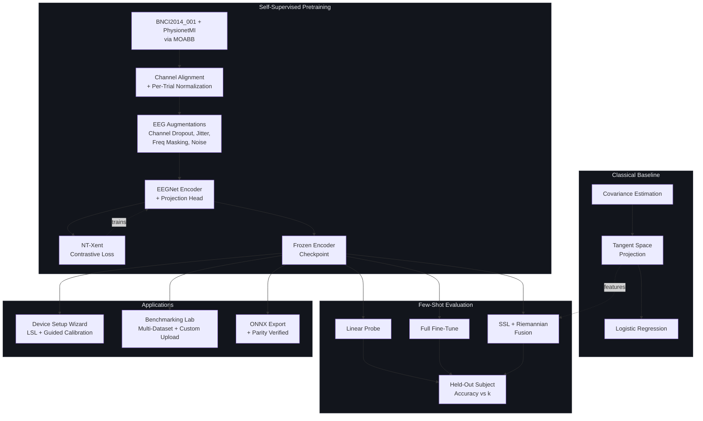

# Self-Supervised Pretraining for Cross-Subject Motor Imagery BCI

A self-supervised pretraining pipeline for subject-independent motor imagery EEG decoding, built to answer one specific question: can contrastive pretraining across many subjects' EEG reduce the labeled-calibration burden a new user faces before a motor-imagery BCI becomes usable? Built as a full engineering exercise — pretraining, a rigorous classical baseline, few-shot evaluation, and two working applications — with an honest account of which interventions actually moved the needle and which didn't.

**Further reading:** [`ARCHITECTURE.md`](ARCHITECTURE.md) (system design, data flow, model details) · [`BENCHMARKS.md`](BENCHMARKS.md) (every experiment run, including the ones that didn't work)

## What this is

- A multi-dataset self-supervised (NT-Xent contrastive) pretrained EEGNet-style encoder, trained across BNCI2014_001 and PhysionetMI with strict subject-level train/holdout separation
- A rigorous classical baseline (Riemannian tangent-space geometry + Logistic Regression) used to contextualize every SSL result, not just as a formality
- A validated few-shot evaluation protocol (linear probing, full fine-tuning, and an SSL+Riemannian fusion method) benchmarked against that baseline on genuinely held-out subjects
- An honest account of three negative results (dataset combination, LR schedule tuning, more pretraining subjects) that did **not** improve accuracy, and the one intervention (feature fusion) that did
- Two working Streamlit applications: a consumer-facing **Device Setup Wizard** (real or simulated LSL streaming, guided calibration, live testing) and an engineer-facing **Benchmarking Lab** (multi-dataset comparison, custom dataset upload, minimum-calibration-trial finder)
- A verified ONNX export of the pretrained encoder, with numerical parity confirmed against the PyTorch original

## What this is not

- Not tested on real EEG hardware — every result uses MOABB research datasets (BNCI2014_001, PhysionetMI), streamed through a real LSL connection via a replay outlet, not live electrodes
- Not a solved calibration problem — the best method (SSL+Riemannian fusion) reaches 80.4% of full-calibration accuracy using 86% less calibration time, not 100% of it
- Not a state-of-the-art SSL result — vanilla contrastive pretraining alone plateaued at 45-47% regardless of data scale, schedule, or augmentation tuning; the gain that mattered came from combining it with a classical feature type, not from better SSL

## Architecture



## Screenshots

**Device Setup Wizard** — guided cue-by-cue calibration against a real or simulated LSL stream

*(add screenshot: `docs/assets/device_wizard.png`)*

**Benchmarking Lab** — minimum-calibration-trial finder, multi-dataset comparison

*(add screenshot: `docs/assets/benchmarking_lab.png`)*

## Results

### Headline: calibration time saved (BNCI2014_001, held-out subjects)

| Method | k=20 accuracy | % of full-calibration ceiling | Calibration time |
|---|---|---|---|
| Random (untrained) encoder + linear probe | 39.1% | 54.1% | 10.7 min |
| Pretrained + linear probe | 46.9% | 64.8% | 10.7 min |
| Pretrained + full fine-tune | 40.4% | 55.9% | 10.7 min |
| **Pretrained + Riemannian fusion** | **58.2%** | **80.4%** | **10.7 min** |
| Riemannian baseline (full data) | 72.3% | 100% | 76.8 min |

Fusing the frozen SSL embedding with Riemannian tangent-space features reaches 80.4% of full-calibration accuracy using 80 labeled trials (~10.7 minutes) instead of 576 trials (~76.8 minutes) — an 86% reduction in required calibration time. This was not the first thing we tried; see `BENCHMARKS.md` for the three approaches that didn't work before this one did.

### Cross-dataset consistency (SSL + Riemannian fusion)

| k | BNCI2014_001 | PhysionetMI |
|---|---|---|
| 1 | 37.7% | 30.2% |
| 5 | 47.8% | 42.0% |
| 10 | 52.1% | 48.3% |
| 20 | 58.0% | 53.1% |

PhysionetMI tracks 4-5 points below BNCI2014_001 at every k — consistent with PhysionetMI's own, noisier classical baseline (67.6% ± 18.1% vs. BNCI's 72.3% ± 8.4%). Full per-subject breakdowns, every negative result, and the methodology behind each number are in `BENCHMARKS.md`.

## Setup

```bash
git clone https://github.com/BurhanxGodhra/bci-ssl-pretrain.git
cd bci-ssl-pretrain
python3 -m venv venv
source venv/bin/activate
pip install -r requirements.txt
pip install -e .
```

**Before first run**, pretrain the encoder (this populates `checkpoints/`, which is gitignored and not shipped in the repo):

```bash
python scripts/pretrain.py    # multi-dataset pretraining; ~7-15 minutes on Apple Silicon MPS
```

Or download a pretrained checkpoint from the [Releases](../../releases) page.

## Running the system

```bash
streamlit run app/main.py
```

Launches the landing page with links to the **Benchmark Demo**, **Device Setup Wizard**, and **Benchmarking Lab** — all in one app, no separate terminals needed.

## Project Structure

bci-ssl-pretrain/
├── app/
│ ├── main.py # Landing page, multi-page navigation
│ └── pages/
│ ├── 1_Benchmark_Demo.py # Held-out subject few-shot demo
│ ├── 2_Device_Setup_Wizard.py # Consumer LSL connect -> calibrate -> test flow
│ └── 3_Benchmarking_Lab.py # Multi-dataset comparison, custom upload
├── src/
│ ├── data/ # MOABB loaders, subject-split leakage firewall, channel alignment, custom-upload validation
│ ├── augmentations/ # EEG-specific contrastive augmentations
│ ├── models/ # EEGNet encoder, projection head, linear probe head
│ ├── losses/ # NT-Xent contrastive loss
│ ├── baselines/ # Riemannian tangent-space classical baseline
│ ├── finetune/ # k-shot sampler, linear probe, full fine-tune, SSL+Riemannian fusion
│ ├── streaming/ # LSL utilities (real device scan + simulated replay outlet)
│ ├── analysis/ # Calibration-time framing
│ ├── visualization/ # Embedding diagnostics, performance curves, subject heatmap
│ └── utils/ # Device resolution, seeding
├── scripts/
│ ├── pretrain.py # Single- and multi-dataset pretraining entrypoints
│ └── export_onnx.py # ONNX export + numerical parity verification
├── tests/ # Every experiment script referenced in BENCHMARKS.md
├── data/splits/ # Committed subject-split manifests (leakage audit trail)
├── results/ # Saved metrics/plots from validated experiments
├── checkpoints/ # Trained encoders (gitignored, regenerated via scripts/pretrain.py)
└── requirements.txt


**Note:** `data/raw/`, `data/processed/`, `checkpoints/`, and `venv/` are intentionally excluded from version control — they're regenerated by running the scripts above, not shipped as static files.

## Limitations

Structural constraints, not resolved by more engineering time alone:

- **No real headset tested** — the Device Setup Wizard's LSL pipeline is real and verified, but only against a replay outlet streaming recorded research data, never live electrodes.
- **Vanilla contrastive pretraining has a real ceiling** — three independent interventions (more pretraining subjects, flat vs. cosine LR schedule, augmentation strength) all converged to the same 45-47% band at k=20. This is not a hyperparameter we haven't found; see `BENCHMARKS.md` for the full negative-result sequence.
- **Fusion requires the Riemannian feature computation at inference time**, not just the frozen encoder — meaningfully more compute than a pure embedding lookup, though still fast at k≤20 sample sizes.
- **Fixed 22-channel montage** — the encoder's spatial weights are tied to specific electrode identities learned during pretraining; a device with a substantially different channel layout is not compatible without retraining (the Benchmarking Lab's upload validator enforces this explicitly rather than silently failing).
- **Class taxonomies don't merge across datasets** — BNCI2014_001 and PhysionetMI have different class sets; evaluation is always scoped to one dataset's taxonomy at a time, even when the underlying encoder was pretrained across both (unsupervised pretraining doesn't have this constraint; supervised evaluation does).

## Engineering Roadmap

1. **Real hardware validation.** The LSL ingestion path is built and tested against a replay outlet; the natural next step is validating the full wizard flow against an actual consumer EEG device.
2. **Broader montage support.** Generalizing beyond the fixed 22-channel requirement — likely via a channel-adaptive encoder architecture — would materially widen which devices the Benchmarking Lab's custom-upload path can actually evaluate.
3. **A metric-learning objective beyond vanilla NT-Xent.** Given that plain contrastive pretraining plateaued regardless of scale/schedule/augmentation, a supervised-contrastive or prototypical-network objective (using pretrain-subject labels, which are available and currently unused) is a more promising lever than further vanilla-SSL tuning.
4. **Test suite.** Experiment scripts in `tests/` currently serve as the verification record for every claim in `BENCHMARKS.md`; converting the core ones (leakage firewall, ONNX parity, channel-alignment correctness) into an automated CI suite would catch regressions the way manual verification occasionally missed them mid-project (see the EOG/STI channel bug and the MNE_DATA config issue, both caught only because a downstream check failed loudly).

## Citations

This project is built on:

- **Datasets**: Brunner, C., Leeb, R., Müller-Putz, G., Schlögl, A., Pfurtscheller, G. (2008). *BCI Competition 2008 – Graz data set A* (BNCI2014_001). Institute for Knowledge Discovery, Graz University of Technology. Schalk, G., McFarland, D.J., Hinterberger, T., Birbaumer, N., Wolpaw, J.R. (2004). *PhysioNet EEG Motor Movement/Imagery Dataset*. Accessed via [MOABB](https://github.com/NeuroTechX/moabb) (Jayaram & Barachant, 2018).
- **Model architecture**: Lawhern, V. J., Solon, A. J., Waytowich, N. R., Gordon, S. M., Hung, C. P., & Lance, B. J. (2018). *EEGNet: A Compact Convolutional Network for EEG-based Brain-Computer Interfaces*. Journal of Neural Engineering.
- **Contrastive objective**: Chen, T., Kornblith, S., Norouzi, M., & Hinton, G. (2020). *A Simple Framework for Contrastive Learning of Visual Representations* (SimCLR / NT-Xent).
- **Classical baseline**: Barachant, A., Bonnet, S., Congedo, M., & Jutten, C. (2012). *Multiclass Brain-Computer Interface Classification by Riemannian Geometry*. IEEE Transactions on Biomedical Engineering. Implemented via [pyRiemann](https://github.com/pyRiemann/pyRiemann).

## License

MIT License — see [LICENSE](LICENSE) for details.