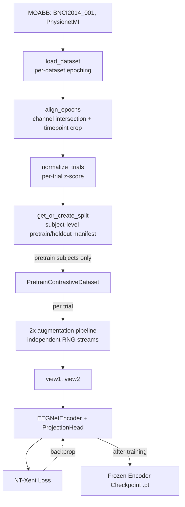
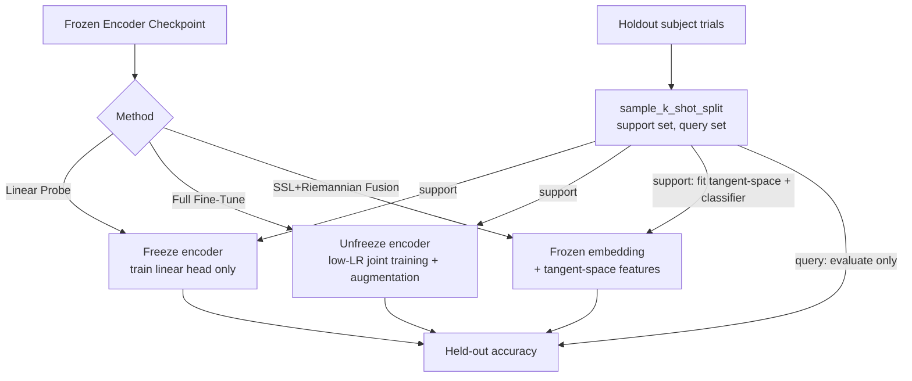
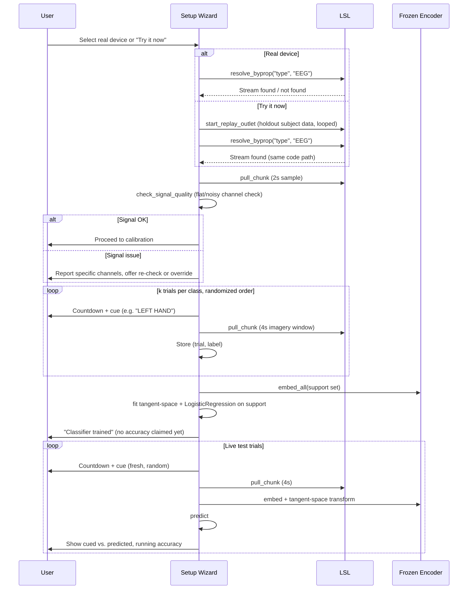
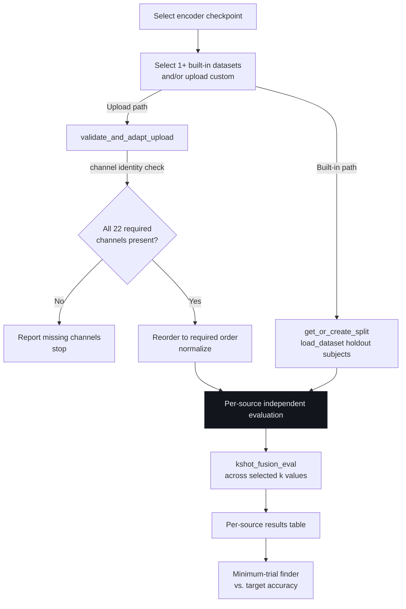

# System & Data Flow

Step-by-step flows for each major pipeline in this project. Complements `ARCHITECTURE.md` (component design) with process-level detail.

## 1. Pretraining data flow

## 2. Few-shot evaluation flow

## 3. Device Setup Wizard user flow

## 4. Benchmarking Lab flow

Note: sources in step H are evaluated **independently** — never combined at the label/classifier level (see `docs/decisions.md`, D-014).